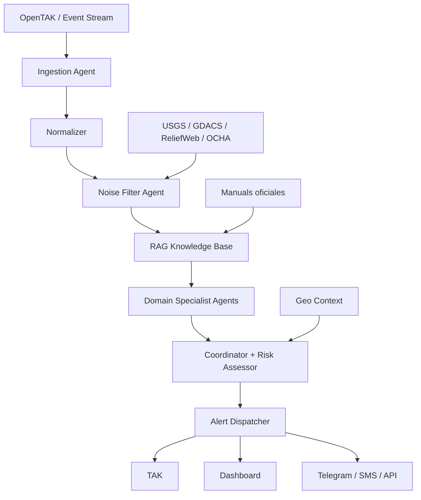

# VigilIA / Atalaya

Agentes IA para gestion de riesgos en tiempo real con TAK/OpenTAK.

## Resumen

VigilIA es una estacion de trabajo inteligente para centros de operaciones de emergencia. Su objetivo es conectarse a un flujo de eventos en tiempo real, como OpenTAK Server o mensajes Cursor on Target, filtrar ruido operacional y entregar solo alertas verificadas, priorizadas y accionables.

El problema principal que resuelve es el exceso de informacion no confiable: falsos positivos, reportes duplicados, datos incompletos, rumores, ubicaciones ambiguas y eventos que no requieren accion inmediata. VigilIA actua como una capa de verificacion y priorizacion antes de que la informacion llegue a rescatistas, coordinadores o tomadores de decision.

## MVP Hackathon

Para una entrega realista en 4h15, el alcance recomendado esta definido en [docs/mvp-spec.md](docs/mvp-spec.md). El orden de construccion por fases esta en [docs/build-phases.md](docs/build-phases.md).

El bucle minimo que se debe dejar funcionando de punta a punta:

1. Un dispositivo o simulador genera un evento CoT.
2. El agente lo escucha en tiempo real.
3. Calcula distancia y rumbo relativo.
4. Un LLM convierte el dato tecnico en una frase tactica clara.
5. El aviso aparece en el dashboard para el coordinador.

OpenTAKServer y el Helm Chart se tratan como infraestructura base reusada. El entregable construido durante el evento es Atalaya: listener, normalizador, motor geografico, generador tactico y dashboard.

## Objetivo Del Proyecto

Construir un sistema multiagente que:

- Ingesta eventos en tiempo real desde TAK/OpenTAK u otras fuentes verificadas.
- Normaliza reportes, ubicaciones, severidad, fuente y timestamp.
- Filtra ruido usando reglas, modelos de lenguaje, similitud semantica y corroboracion entre fuentes.
- Consulta manuales oficiales y reportes actualizados mediante RAG.
- Evalua riesgos por dominio: rescate, sismos, incendios, deslizamientos, seguridad y salud.
- Genera alertas breves, verificables y accionables.
- Devuelve alertas al ecosistema operativo: TAK, dashboard, Telegram, SMS o API.

## Casos De Uso

- Centro de operaciones que recibe muchos reportes simultaneos durante un desastre.
- Rescatistas que necesitan saber que eventos son reales y urgentes.
- Coordinadores que deben priorizar recursos limitados.
- ONGs o entidades publicas que publican reportes diarios y necesitan cruzarlos con eventos en campo.
- Analistas que quieren detectar patrones de riesgo, duplicados o desinformacion.

## Arquitectura Propuesta



## Agentes Principales

### 1. Ingestion Agent

Recibe eventos desde TAK/OpenTAK, WebSocket, MQTT, Kafka, APIs externas o archivos de prueba. Convierte cada entrada en un modelo comun de evento.

Responsabilidades:

- Leer mensajes CoT o payloads JSON.
- Extraer ubicacion, tipo de evento, fuente, timestamp y descripcion.
- Detectar errores de formato.
- Enviar eventos normalizados al pipeline.

### 2. Noise Filter Agent

Es el componente mas importante del sistema. Decide si un evento debe continuar en el flujo o descartarse como ruido.

Criterios de filtrado:

- Fuente confiable o verificable.
- Ubicacion valida.
- Severidad minima.
- No duplicado reciente.
- Coincidencia con patrones de riesgo conocidos.
- Corroboracion por multiples fuentes cuando sea necesario.
- Confidence score superior al umbral definido.

Salida esperada:

```json
{
  "event_id": "evt_001",
  "decision": "pass",
  "confidence": 0.87,
  "reason": "Reporte corroborado por fuente externa y patron compatible con emergencia real",
  "required_action": "Evaluar envio de unidad de reconocimiento"
}
```

### 3. RAG Knowledge Base

Base de conocimiento con manuales oficiales, reportes diarios y documentos tecnicos. Sirve para fundamentar recomendaciones.

Fuentes iniciales recomendadas:

- INSARAG Guidelines.
- FEMA Urban Search and Rescue manuals.
- IFRC / Cruz Roja.
- Sphere Standards.
- PAHO/WHO Health in Emergencies.
- Manuales nacionales de proteccion civil.
- USGS, GDACS, ReliefWeb, OCHA e IFRC.

### 4. Domain Specialist Agents

Agentes especializados que interpretan eventos segun el tipo de riesgo.

Perfiles sugeridos:

- Rescate urbano y USAR.
- Sismos y alerta temprana.
- Incendios.
- Deslizamientos.
- Verificacion de informacion y seguridad.
- Salud publica en emergencias.

### 5. Coordinator + Risk Assessor

Integra los analisis de los especialistas y decide prioridad operacional.

Produce:

- Nivel de riesgo.
- Prioridad.
- Accion recomendada.
- Justificacion basada en fuentes.
- Mensaje final para operador humano.

### 6. Alert Dispatcher

Envia alertas a los canales configurados.

Canales posibles:

- TAK/OpenTAK como mensaje CoT.
- Dashboard web.
- Telegram.
- SMS.
- Webhook.
- API interna.

## Stack Tecnologico

Backend:

- Python 3.11+.
- FastAPI para API y dashboard backend.
- LangGraph para orquestacion de agentes.
- Pydantic para modelos de datos.
- Asyncio para procesamiento en tiempo real.

TAK / Tiempo real:

- `pytak` para integracion con TAK.
- WebSocket, MQTT o Kafka segun infraestructura.

RAG:

- LlamaIndex o LangChain.
- Qdrant o Chroma como vector database.
- OpenAI embeddings o embeddings locales.

Geolocalizacion:

- Shapely.
- GeoPandas.
- geopy.
- Folium o MapLibre para visualizacion.

Frontend:

- React + Vite para dashboard.
- MapLibre o Leaflet para mapa.
- Tailwind CSS para UI rapida.

Calidad:

- pytest.
- ruff.
- mypy.
- pre-commit.
- GitHub Actions.

## Estructura Recomendada Del Repositorio

```text
hackaton-atalaya/
├── README.md
├── docs/
│   ├── architecture.md
│   ├── knowledge_sources.md
│   ├── demo_script.md
│   └── risk_model.md
├── src/
│   ├── agents/
│   │   ├── ingestion_agent.py
│   │   ├── noise_filter_agent.py
│   │   ├── specialist_agents.py
│   │   └── coordinator_agent.py
│   ├── core/
│   │   ├── models.py
│   │   ├── scoring.py
│   │   └── settings.py
│   ├── data_sources/
│   │   ├── tak_client.py
│   │   ├── usgs_client.py
│   │   ├── gdacs_client.py
│   │   └── reliefweb_client.py
│   ├── rag/
│   │   ├── ingest_documents.py
│   │   └── retriever.py
│   ├── alerts/
│   │   ├── dispatcher.py
│   │   └── cot_builder.py
│   └── api/
│       └── main.py
├── knowledge_base/
│   ├── manuals/
│   ├── reports/
│   └── vectorstore/
├── frontend/
├── tests/
├── .github/
│   └── workflows/
├── pyproject.toml
└── .env.example
```

## Modelo De Evento

```python
from datetime import datetime
from typing import Literal
from pydantic import BaseModel, Field


class RiskEvent(BaseModel):
    id: str
    source: str
    source_reliability: float = Field(ge=0, le=1)
    event_type: Literal[
        "earthquake",
        "fire",
        "landslide",
        "rescue",
        "security",
        "health",
        "unknown",
    ]
    title: str
    description: str
    latitude: float
    longitude: float
    timestamp: datetime
    raw_payload: dict
```

## Modelo De Alerta

```python
from typing import Literal
from pydantic import BaseModel, Field


class RiskAlert(BaseModel):
    event_id: str
    priority: Literal["low", "medium", "high", "critical"]
    confidence: float = Field(ge=0, le=1)
    summary: str
    recommended_action: str
    evidence: list[str]
    send_to_tak: bool
    send_to_dashboard: bool = True
```

## Pipeline MVP

1. Crear modelos `RiskEvent` y `RiskAlert`.
2. Simular entrada de eventos con un archivo JSON.
3. Implementar `NoiseFilterAgent` con reglas basicas.
4. Agregar scoring de confianza.
5. Crear RAG con 3 a 5 documentos/manuales iniciales.
6. Implementar un especialista inicial, por ejemplo sismos o rescate.
7. Crear `CoordinatorAgent` para generar alerta final.
8. Exponer una API con FastAPI.
9. Crear dashboard simple con mapa y lista de alertas.
10. Preparar demo con eventos reales, ruido, duplicados y una emergencia valida.

## Scoring Inicial De Ruido

Formula simple para MVP:

```text
confidence =
  0.30 * source_reliability +
  0.20 * location_quality +
  0.20 * event_severity +
  0.15 * corroboration_score +
  0.15 * semantic_match_score
```

Umbrales:

- `0.00 - 0.39`: descartar.
- `0.40 - 0.69`: observar, no alertar.
- `0.70 - 0.84`: alerta media/alta.
- `0.85 - 1.00`: alerta prioritaria.

## Demo Para Hackathon

La demo debe mostrar claramente el antes y despues:

- Entrada con 20 eventos mezclados.
- 12 eventos irrelevantes o duplicados.
- 5 eventos inciertos que quedan en observacion.
- 3 eventos reales que generan alerta.
- Dashboard con mapa, ranking de prioridad y evidencia.
- Explicacion de por que cada alerta fue aprobada o descartada.

Flujo narrativo:

1. "El centro de operaciones recibe demasiada informacion."
2. "VigilIA normaliza y verifica cada reporte."
3. "El filtro de ruido elimina duplicados y falsos positivos."
4. "Los agentes especialistas consultan manuales oficiales."
5. "El coordinador entrega una alerta accionable y trazable."

## Roadmap De Construccion

### Fase 1: Fundacion

- Crear estructura del repositorio.
- Definir modelos de datos.
- Crear dataset de eventos simulados.
- Implementar scoring basico.
- Agregar tests unitarios.

### Fase 2: Agentes

- Implementar pipeline con LangGraph.
- Crear agente de filtrado.
- Crear agente especialista inicial.
- Crear coordinador.
- Guardar decisiones y explicaciones.

### Fase 3: Conocimiento

- Ingestar manuales PDF.
- Crear vectorstore.
- Implementar retrieval con citas.
- Agregar fuentes externas como USGS y ReliefWeb.

### Fase 4: Interfaz

- Dashboard con mapa.
- Bandeja de eventos entrantes.
- Panel de alertas priorizadas.
- Vista de evidencia y recomendaciones.

### Fase 5: Integracion TAK

- Conectar con `pytak`.
- Leer mensajes CoT.
- Enviar alertas como CoT.
- Probar con entorno TAK controlado.

## Criterios De Exito

- Reduce ruido de eventos en al menos 60% durante la demo.
- Cada alerta tiene confidence score y evidencia.
- El sistema no envia alertas sin justificacion.
- El operador puede ver por que un evento fue descartado.
- El flujo funciona en tiempo real o pseudo-tiempo-real.
- La arquitectura permite agregar nuevos dominios de riesgo.

## Buenas Practicas

- Mantener trazabilidad: toda decision debe tener razon y evidencia.
- Separar reglas deterministicas de decisiones LLM.
- No depender solo del modelo de lenguaje para eventos criticos.
- Usar umbrales conservadores para alertas de emergencia.
- Registrar eventos descartados para auditoria.
- Probar con datasets que incluyan ruido, duplicados y reportes contradictorios.
- Versionar prompts, reglas y manuales.
- Documentar fuentes oficiales.

## Primer Sprint Sugerido

Entregable del primer sprint:

- API FastAPI con endpoint `/events`.
- Agente de ruido con scoring.
- Dataset `sample_events.json`.
- Dashboard minimo con eventos aceptados y descartados.
- README con instrucciones de ejecucion.

Comandos esperados:

```bash
uv sync
uv run pytest
uv run fastapi dev src/api/main.py
```

## Nombre Y Posicionamiento

Nombre recomendado para hackathon: `Atalaya`.

Nombre completo: `VigilIA Atalaya`.

Frase corta:

> Una estacion inteligente para transformar ruido operativo en alertas verificadas durante emergencias.

## Pendientes Por Confirmar

- Confirmar si el servidor objetivo es OpenTAK Server.
- Definir canal principal de alerta para la demo.
- Elegir dominio inicial: sismos, rescate, incendios o deslizamientos.
- Definir si el LLM sera local, API o mixto.
- Seleccionar documentos oficiales iniciales para RAG.
