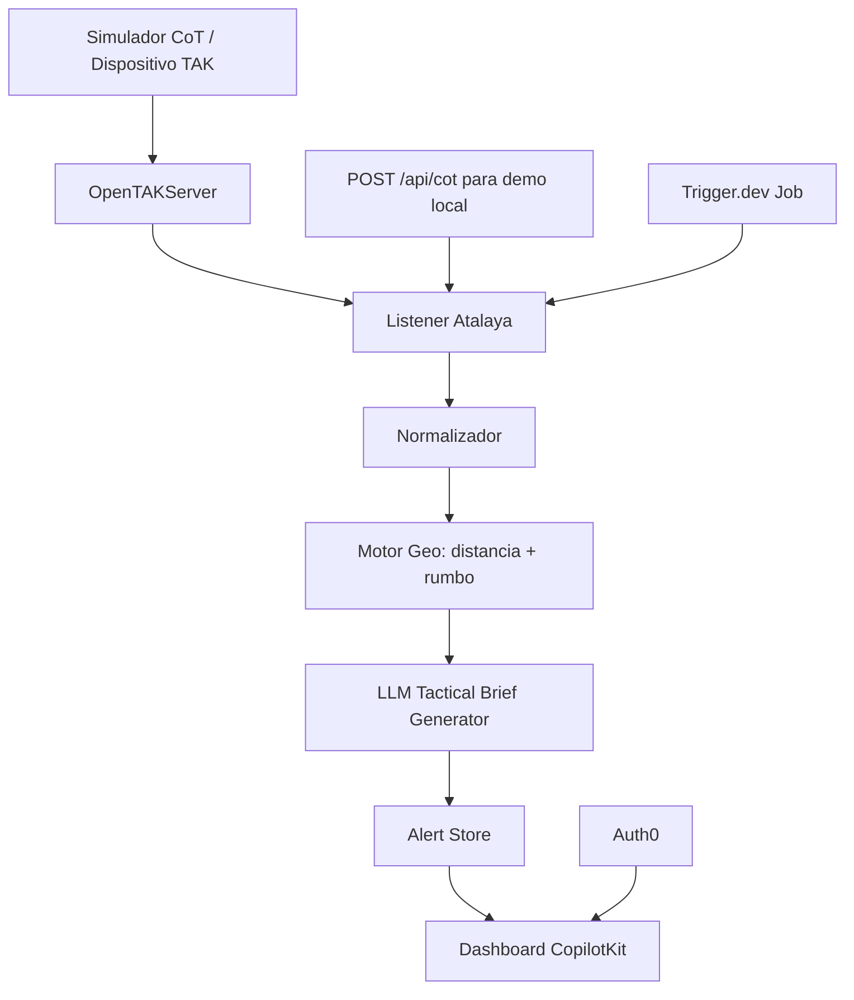

# Spec MVP: VigilIA Atalaya

Entrega minima viable para construir en 4h15, de 11:15 a 15:30.

## Decisión De Producto

El MVP no intenta construir toda la plataforma multiagente de gestion de riesgos. Construye y demuestra un bucle tactico completo:

1. Un dispositivo o simulador genera un evento CoT.
2. El listener recibe el evento en tiempo real desde OpenTAKServer o un endpoint compatible.
3. El motor geografico calcula distancia y rumbo relativo desde una posicion de referencia.
4. Un LLM convierte el evento y la geometria en una frase tactica clara.
5. El dashboard muestra el aviso en vivo y permite al coordinador verlo como feed operativo.

La promesa central es transformar un evento tecnico de TAK en una alerta humana, breve y accionable.

## Alcance Construido Durante El Evento

Se entrega como trabajo propio del hackathon:

- Listener de eventos CoT o JSON compatible con CoT.
- Normalizador de evento tactico.
- Calculo de distancia, rumbo y orientacion relativa.
- Prompt y llamada LLM para redactar aviso tactico.
- Dashboard minimo con feed en vivo.
- Simulador de 2 o 3 dispositivos.
- Job de background con reintentos.
- Login basico.
- Guion de demo y eventos simulados.

Se declara como infraestructura reusada:

- OpenTAKServer desplegado.
- Helm Chart de OpenTAKServer.
- Cualquier componente base de TAK usado como plataforma.

Esta distincion debe aparecer en README, demo y presentacion para evitar dudas de elegibilidad.

## No Alcance Del MVP

Estos puntos quedan fuera del camino critico:

- RAG completo con manuales oficiales.
- Motor multiagente por dominios.
- Deduccion avanzada de objetivos de mision.
- Integracion con todos los patrocinadores.
- Analisis criminal, salud publica o verificacion OSINT.
- Mobile app nativa.
- Procesamiento robusto de mapas offline.

Pueden aparecer como "next steps" o extras si sobra tiempo.

## Sponsors Priorizados

### OpenAI u OpenRouter

Uso: generacion del aviso tactico.

Justificacion: es el nucleo del valor de IA. El sistema toma datos tecnicos y genera lenguaje operacional claro.

Ejemplo:

Entrada:

```json
{
  "type": "CASEVAC",
  "distance_m": 830,
  "bearing_deg": 42,
  "relative_direction": "noreste",
  "source": "Alpha-2",
  "details": "1 herido, sangrado moderado, requiere extraccion"
}
```

Salida:

```text
CASEVAC reportado por Alpha-2 a 830 metros al noreste. Prioridad alta: un herido con sangrado moderado requiere extraccion. Coordinar equipo medico y ruta segura hacia el punto.
```

### CopilotKit

Uso: dashboard minimo y UI generativa para el coordinador.

Justificacion: permite que el operador pregunte por eventos recientes, resuma el feed o reformule avisos sin construir una interfaz compleja desde cero.

Funciones MVP:

- Feed en vivo.
- Panel de aviso tactico.
- Componente tipo copiloto para preguntar: "Que paso en los ultimos 5 minutos?"

### Trigger.dev

Uso: job de escucha viva con reintentos.

Justificacion: demuestra arquitectura operacional real. El listener no es solo un script manual; queda como proceso de background resiliente.

Funciones MVP:

- Job `listen-cot-events`.
- Reintento en error de red.
- Log de eventos procesados.
- Emision hacia backend/dashboard.

### Auth0

Uso: login basico para dashboard.

Justificacion: en rescate real, los eventos no deben quedar publicos. Un login basico agrega seriedad sin robar demasiado tiempo.

Funciones MVP:

- Login/logout.
- Dashboard protegido.
- Usuario autenticado visible en header.

## Sponsors Fuera Del MVP

### Exa

Se deja fuera salvo que sobre tiempo para agregar "manual tactico conversacional".

Uso extra posible:

- Buscar un protocolo publico real.
- Resumirlo y adjuntarlo como recomendacion.

### Ambiguous AI

Se deja fuera para no duplicar la capa de interfaz. El frente principal sera CopilotKit.

## Arquitectura MVP



## Camino Critico Tecnico

### 1. Ingesta

Endpoint MVP:

```http
POST /api/cot
```

Payload aceptado:

```json
{
  "uid": "alpha-2-casevac-001",
  "type": "CASEVAC",
  "callsign": "Alpha-2",
  "lat": 4.7111,
  "lon": -74.0721,
  "time": "2026-09-12T16:25:00Z",
  "detail": {
    "message": "1 herido, sangrado moderado, requiere extraccion",
    "priority": "high"
  }
}
```

Para demo, el listener puede consumir:

- Eventos reales desde OpenTAKServer si esta estable.
- El endpoint `/api/cot` con simulador local como fallback.

### 2. Posicion De Referencia

La demo necesita una posicion base para calcular distancia y rumbo.

Ejemplo:

```json
{
  "callsign": "Command",
  "lat": 4.7100,
  "lon": -74.0800
}
```

### 3. Calculo Geografico

Funciones necesarias:

- `haversine_distance_m(origin, target)`.
- `bearing_degrees(origin, target)`.
- `bearing_to_cardinal_es(degrees)`.

Salida:

```json
{
  "distance_m": 883,
  "bearing_deg": 82,
  "relative_direction": "este"
}
```

### 4. Generacion Tactica

Prompt base:

```text
Eres un asistente tactico para un centro de operaciones de emergencia.
Convierte el evento en un aviso breve, claro y accionable.
No inventes datos. Usa solo la informacion recibida.
Incluye: tipo de evento, fuente, distancia, direccion relativa, prioridad y accion sugerida.
Maximo 2 frases.

Evento:
{event_json}

Geometria:
{geo_json}
```

Contrato de salida:

```json
{
  "headline": "CASEVAC a 883 m al este",
  "brief": "Alpha-2 reporta un herido con sangrado moderado a 883 metros al este. Prioridad alta: coordinar extraccion medica y confirmar ruta segura.",
  "priority": "high",
  "recommended_action": "Enviar equipo medico y confirmar seguridad de ruta"
}
```

### 5. Dashboard

Pantallas minimas:

- Login.
- Feed de eventos.
- Panel de alerta seleccionada.
- Indicador "listener online".
- Boton para simular eventos.
- Copilot de coordinador para resumir el feed.

Columnas del feed:

- Hora.
- Fuente.
- Tipo.
- Distancia.
- Direccion.
- Prioridad.
- Aviso tactico.

### 6. Background Job

Job Trigger.dev:

```text
listen-cot-events
```

Responsabilidades:

- Mantener escucha activa.
- Reintentar conexion.
- Procesar eventos entrantes.
- Publicar resultados al backend.
- Registrar errores.

## Eventos Simulados Para Demo

### Evento 1: CASEVAC Prioritario

```json
{
  "uid": "demo-casevac-001",
  "type": "CASEVAC",
  "callsign": "Alpha-2",
  "lat": 4.7111,
  "lon": -74.0721,
  "time": "2026-09-12T16:25:00Z",
  "detail": {
    "message": "1 herido, sangrado moderado, requiere extraccion",
    "priority": "high"
  }
}
```

Narrativa: muestra que el sistema transforma un reporte tecnico en una instruccion operativa inmediata.

### Evento 2: Hallazgo De Persona

```json
{
  "uid": "demo-find-001",
  "type": "FINDING",
  "callsign": "Bravo-1",
  "lat": 4.7065,
  "lon": -74.0832,
  "time": "2026-09-12T16:27:00Z",
  "detail": {
    "message": "Persona localizada consciente, movilidad limitada",
    "priority": "medium"
  }
}
```

Narrativa: muestra priorizacion media y recomendacion de evaluacion.

### Evento 3: Alerta De Riesgo

```json
{
  "uid": "demo-hazard-001",
  "type": "HAZARD",
  "callsign": "Charlie-3",
  "lat": 4.7140,
  "lon": -74.0860,
  "time": "2026-09-12T16:29:00Z",
  "detail": {
    "message": "Cable electrico caido bloqueando ruta principal",
    "priority": "critical"
  }
}
```

Narrativa: muestra que no todo es rescate medico; tambien se advierten riesgos para equipos en campo.

### Evento 4: Ruido Controlado

```json
{
  "uid": "demo-noise-001",
  "type": "CHAT",
  "callsign": "Unknown",
  "lat": 4.7101,
  "lon": -74.0801,
  "time": "2026-09-12T16:30:00Z",
  "detail": {
    "message": "probando radio, ignora este mensaje",
    "priority": "low"
  }
}
```

Narrativa: muestra filtrado minimo de ruido sin abrir el alcance de noise filtering avanzado.

## Plan De Construccion 4h15

| Hora | Entregable | Detalle |
|---|---|---|
| 11:15-12:00 | Listener + endpoint | `/api/cot`, normalizador y store en memoria |
| 12:00-12:45 | Geo + LLM | distancia, rumbo, prompt y salida estructurada |
| 12:45-13:30 | Dashboard | feed vivo, panel de alerta, boton de simulacion |
| 13:30-14:00 | Trigger.dev | job con reintentos y logs |
| 14:00-14:30 | Auth0 | login simple y ruta protegida |
| 14:30-15:30 | Demo | eventos simulados, fallback, video y polish |

## Fallbacks

### Si OpenTAKServer falla

Usar `/api/cot` con el simulador local. La demo sigue siendo valida porque el agente y dashboard funcionan de punta a punta.

### Si el LLM falla

Usar template deterministicamente:

```text
{type} reportado por {callsign} a {distance_m} metros al {relative_direction}. Prioridad {priority}: {message}.
```

### Si Auth0 toma demasiado tiempo

Mostrar pantalla protegida con variable `DEMO_AUTH_ENABLED=false` y dejar Auth0 documentado como configurado para produccion.

### Si Trigger.dev toma demasiado tiempo

Ejecutar listener como proceso local y dejar una tarea `trigger/listen-cot-events.ts` lista aunque no este desplegada.

## Criterios De Aceptacion

El MVP esta listo si:

- Se puede enviar un evento simulado y verlo aparecer en el dashboard.
- Cada evento aceptado muestra distancia y rumbo relativo.
- El LLM genera una frase tactica en menos de algunos segundos.
- El dashboard permite distinguir prioridad alta, media y critica.
- Existe fallback si TAK, LLM, Auth0 o Trigger.dev fallan.
- La presentacion explica claramente que OpenTAKServer es infraestructura reusada y el agente es el entregable construido.

## Guion Corto De Demo

1. Mostrar dashboard protegido.
2. Activar listener.
3. Simular `CASEVAC` desde Alpha-2.
4. Mostrar distancia, rumbo y aviso tactico generado.
5. Simular `HAZARD` desde Charlie-3.
6. Preguntar al copiloto: "Resume las alertas criticas activas".
7. Mostrar que el ruido `CHAT` no interrumpe el feed prioritario.
8. Cerrar con: "Atalaya convierte eventos TAK en instrucciones claras para equipos de emergencia en tiempo real".

## Mensaje De Elegibilidad

Texto recomendado para README o submission:

```text
Durante el hackathon construimos Atalaya: el agente de escucha, normalizacion, calculo geografico, generacion tactica con LLM y dashboard operativo. OpenTAKServer y su Helm Chart se usan como infraestructura base preexistente, equivalente a una libreria o servicio desplegado. El valor entregado durante el evento esta en el agente que transforma eventos CoT en avisos tacticos claros y accionables.
```

## Decision Recomendada

Usar CopilotKit como frente de interfaz principal. Ambiguous AI queda fuera del MVP para evitar duplicar trabajo de UI. Exa queda como extra solo si sobra tiempo para una funcion de consulta de protocolo.
